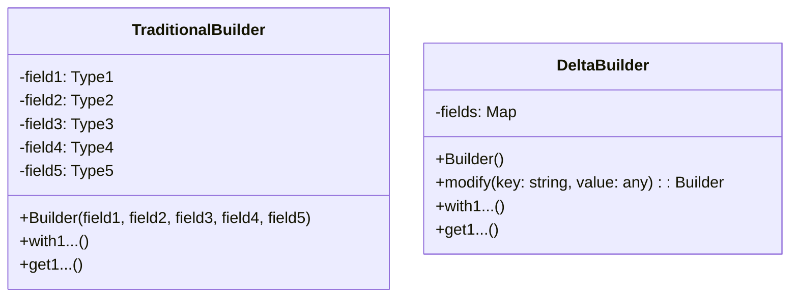
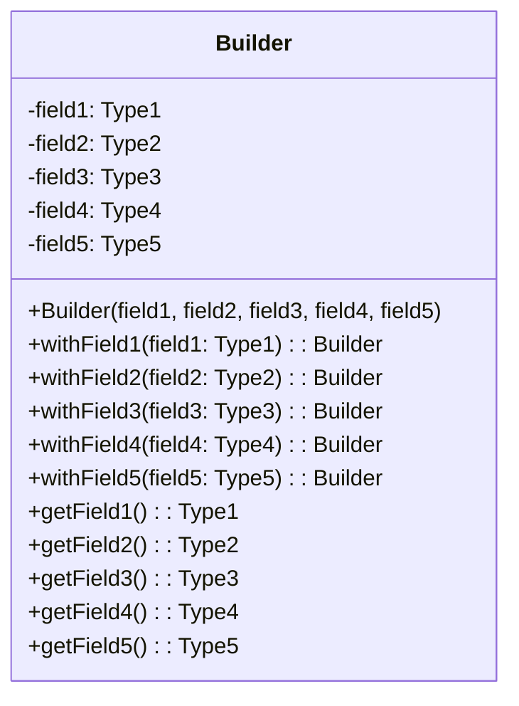
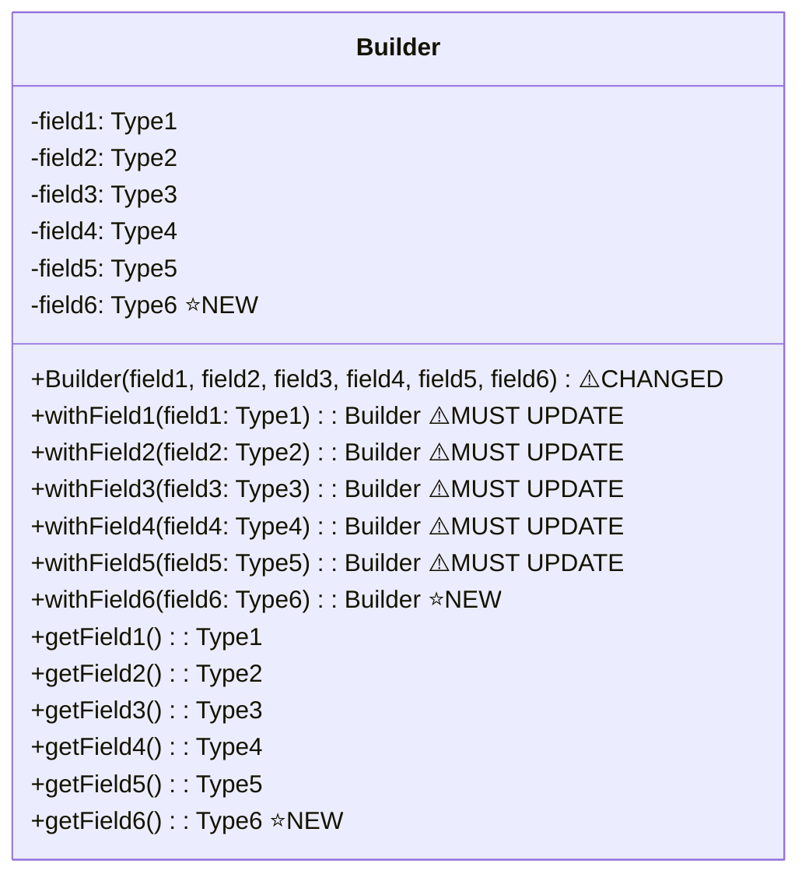
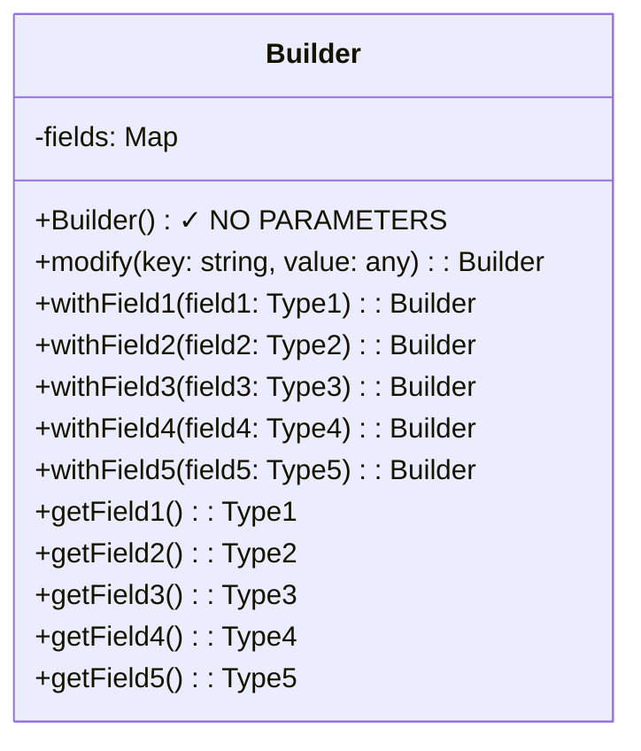
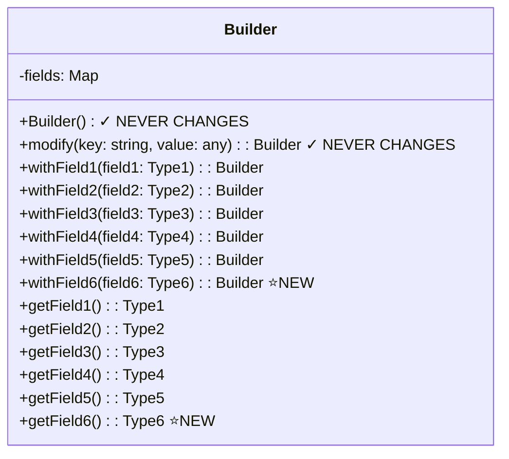

# Delta Builder Pattern

## The Problem: Adding Fields to Immutable Objects

When you have an immutable object with multiple fields, adding a new field requires changing the constructor and every method that creates a copy.

## Example Usage

```typescript
const builder = new Builder()
  .withField1(1) // creates new immutable Builder
  .withField2(2); // creates another new immutable Builder
```

Each call to `withFieldX()` returns a **new immutable object**, leaving the previous object unchanged.

## Quick Comparison



## Traditional Immutable Pattern (5 fields)



**Each `withX` method must reconstruct with all 5 parameters:**

```typescript
withField2(field2: Type2): Builder {
  return new Builder(
    this.field1,
    field2,           // only this changed
    this.field3,
    this.field4,
    this.field5
  );
}
```

## Traditional Pattern: Adding 6th Field (field6)



**Must update constructor + ALL 5 `withX` methods:**

```typescript
// Constructor changes
constructor(
  field1, field2, field3, field4, field5,
  field6  // NEW parameter
) { ... }

// EVERY withX method must now pass 6 parameters
withField2(field2: Type2): Builder {
  return new Builder(
    this.field1,
    field2,
    this.field3,
    this.field4,
    this.field5,
    this.field6  // Must add to ALL methods
  );
}
```

**Changes required: 1 constructor + 5 methods = 6 places to update**

---

## Delta Builder Pattern (5 fields)



**Each `withX` method delegates to `modify`:**

```typescript
withField2(field2: Type2): Builder {
  return this.modify("Field2", field2);
}
```

**The `modify` method handles ALL copying & Encapsulates the Mutability:**

```typescript
modify(key: string, value: any): Builder {
  const next = new Builder();
  for (const k in this.fields) {
    next.fields[k] = this.fields[k];  // Copy everything
  }
  next.fields[key] = value;  // The 1 and only 1 mutation
  return next;
}
```

## Delta Builder: Adding 6th Field (field6)



**Only add 2 new methods:**

```typescript
withField6(field6: Type6): Builder {
  return this.modify("Field6", field6);
}

getField6(): Type6 {
  return this.get("Field6", () => defaultValue);
}
```

**Changes required: 0 constructor + 0 existing methods = Just 2 new methods**

---

## Comparison

| Action                    | Traditional Pattern                        | Delta Builder Pattern     |
| ------------------------- | ------------------------------------------ | ------------------------- |
| Add 6th field             | Change constructor + 5 methods (6 changes) | Add 2 methods (2 changes) |
| Constructor parameters    | Grows with each field                      | Always zero               |
| Existing methods affected | ALL methods must update                    | ZERO methods change       |
